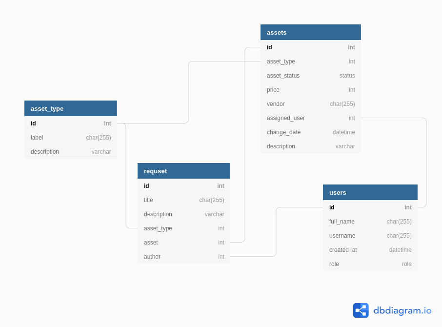

# Система учета имущества компании

## Постановка задачи:
Приложения для учета вещей, имущества, оборудования компании. Создать единое место для компании, где можно проводить учет и контроль имущества, а для сотрудников, место для создания запросов на обновление или обслуживания текущего оборудования.

## Сущности: 
    • Пользователь:
        ◦ ФИО 
        ◦ Роль (пользователь (employee),  администратор)
    • Вещь «Asset»:
        ◦ Type (laptop, mobile phone, monitor, TV, other equipment)
        ◦ Status (ready for assignment, assigned, on repair, retired, lost)
        ◦ Price
        ◦ Vendor
        ◦ Assigned user 
        ◦ Change date 
    • Запрос (сообщение) «Ticket»
        ◦ Author
        ◦ Title
        ◦ Description
        ◦ Related item

### Администратор имеет возможности:
    • просматривать все вещи
    • фильтровать по статусу, по пользователю
    • назначать вещь сотруднику,
    • переводить вещь из одного статуса в другой
    • отвечать на запросы сотрудника. (approve, decline)

### Сотрудник может:
    • просматривать свое оборудование
    • создавать запрос на ремонт, обслуживание, апгрейд текущего или создавать запрос на получение нового
 
# База данных 

